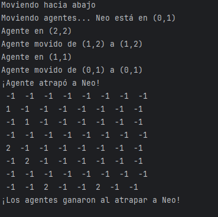
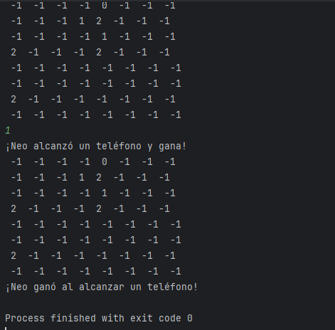
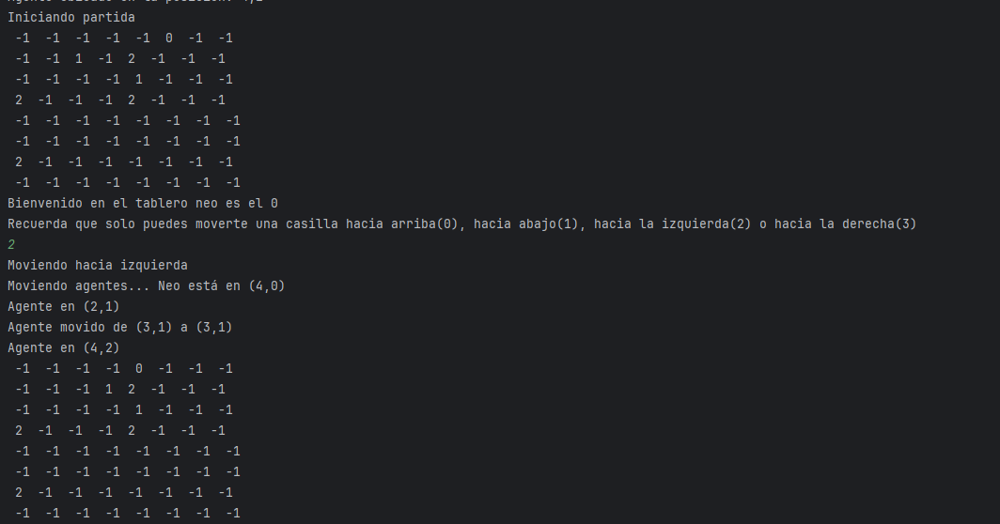
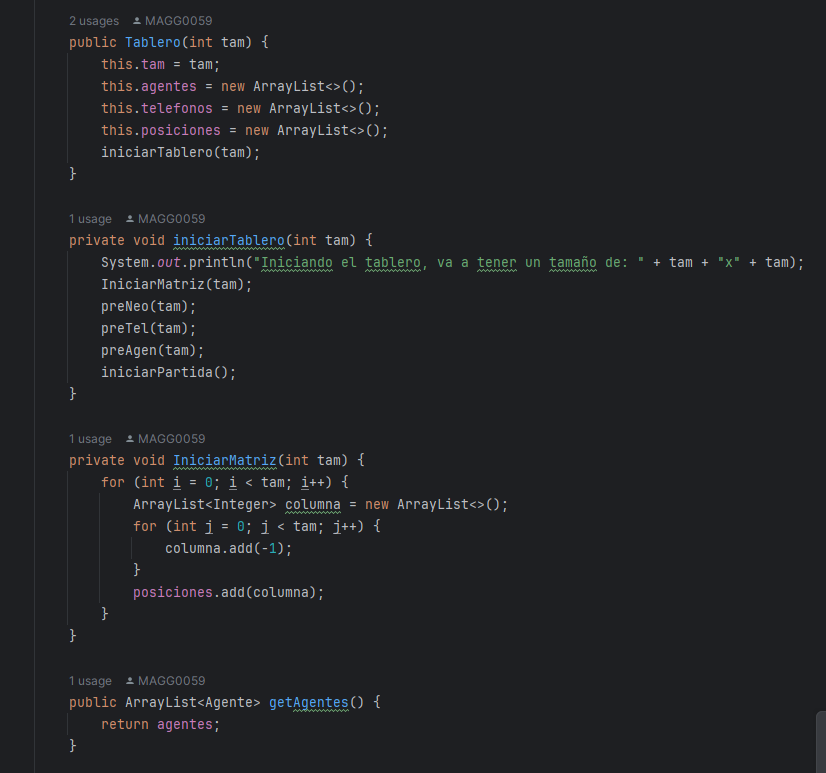
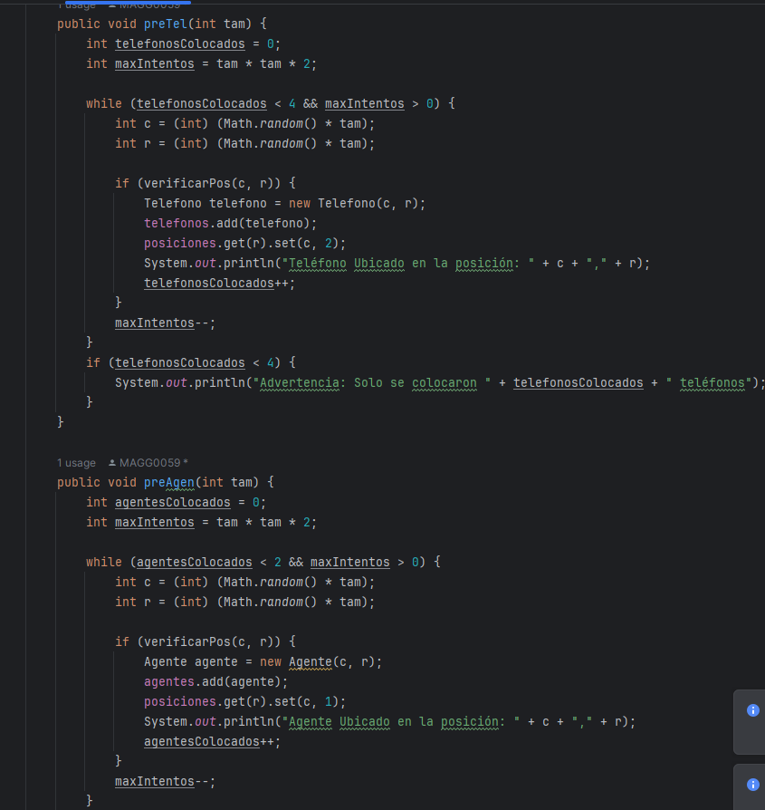
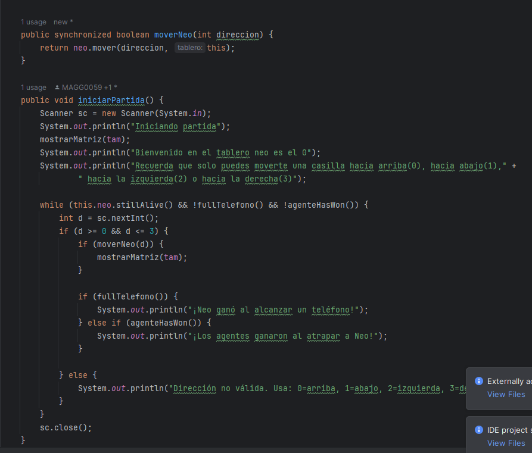
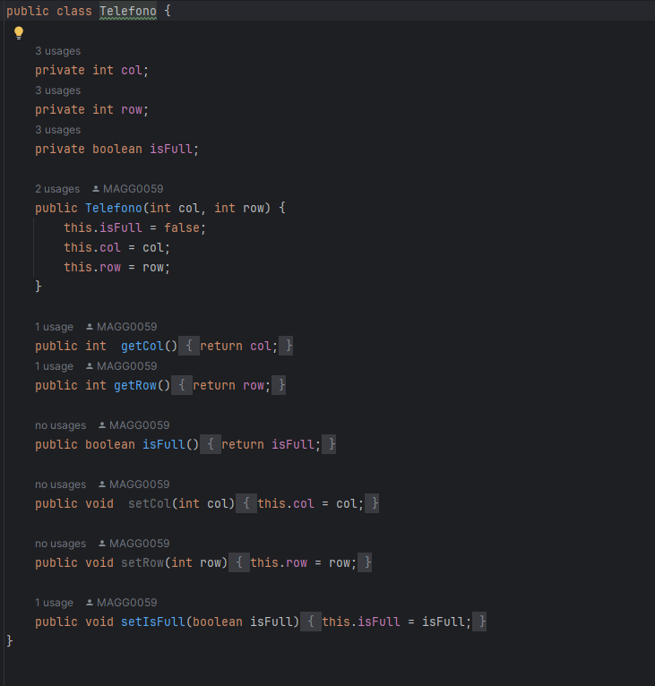
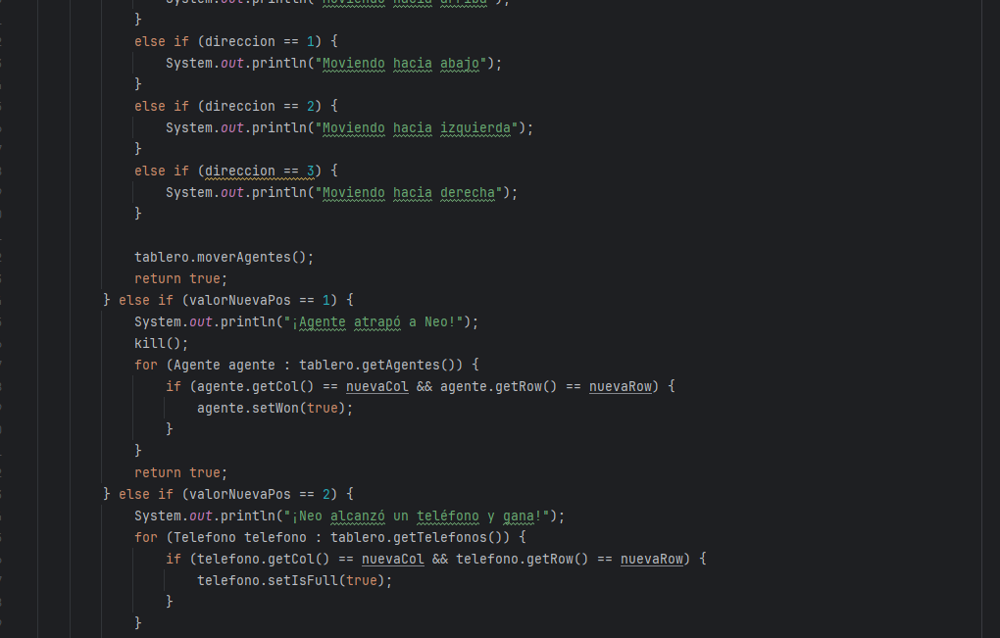
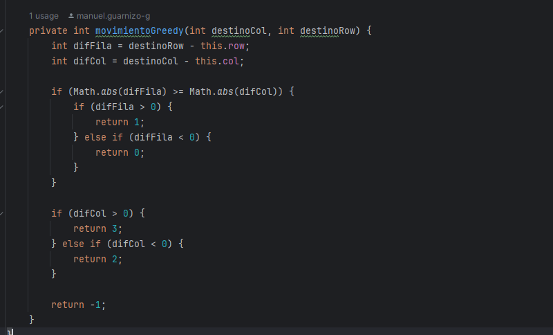

## Juego Manuel Guarnizo 

### Contexto y jugabilidad

El juego consiste en una matriz donde hay dos agentes identificados con el número 1, 4 telefonos identificados con el número 2
las demas casillas son -1 y nuestro personaje va avanzando hasta llegar  a un telefono o a hasta ser atrapado por un agente

### Clase Tablero

Esta clase es la encargada de alistar los elementos del juego,el tablero osea la matriz los elementos y llmar los elementos de 
los personajes

### Clase Telefono

Esta clase es la encargda de salvar al jugador, se dispersa aleatoriamente en el tablero y cuando Neo llega a uno de esos 
el juego se termina

### Clase Neo

Neo tiene una logica de movimientos a atraves de teclas y numeros del teclado estosson llamados desde tablero y neo 
analiza y realiza su propio movimiento

### Clase Agente 

Esta es la clase encargada de persegir a neo por el tablero usa un algoritmo greedy para detectar cual es el movimiento
inmediatamente optimo y ejecuta hasta que esta en la misma de neo acabando el juego, sus misma clase calcula su mejor siguiente movimiento
